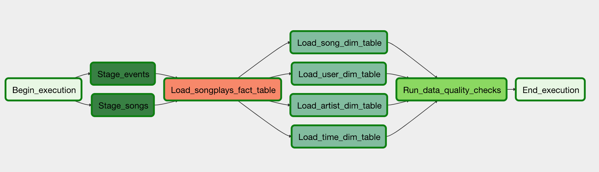

#  🎵 Data Pipelines with Airflow – Sparkify Project

## 📌 Project Overview

This project builds an **automated and monitored ETL data pipeline** for a fictional music streaming company, **Sparkify**, using **Apache Airflow**.

The goal is to move raw data from **Amazon S3** into a **Redshift data warehouse**, transform it into a star schema, and run **data quality checks** to ensure reliability for analytics.

The pipeline is:
- Dynamic
- Reusable
- Monitorable
- Backfill-enabled
---

## 🏗️ Architecture

The pipeline performs the following steps:

1. **Stage raw data from S3 → Redshift**
2. **Transform data into fact and dimension tables**
3. **Run data quality checks**

---

## 📂 Datasets

Two datasets stored in S3:

- 🎧 Log Data  
  `s3://udacity-dend/log_data`

- 🎵 Song Data  
  `s3://udacity-dend/song-data`

These datasets contain:
- User activity logs (JSON)
- Song metadata (JSON)

---


## ⚙️ Technologies Used

- Apache Airflow
- Amazon S3
- Amazon Redshift (Serverless)
- Python
- SQL
- AWS IAM

---

## 🔄 DAG Workflow


---

## 🧩 Custom Operators

This project implements four reusable Airflow operators:

### 1. Stage Operator
- Loads JSON data from S3 into Redshift staging tables
- Uses dynamic COPY SQL commands
- Supports execution-time templating for backfills

---

### 2. Fact & Dimension Load Operators

#### Fact Table Operator
- Loads large fact tables (append-only)
- Inserts transformed data into Redshift

#### Dimension Table Operator
- Uses **truncate-insert pattern**
- Clears table before loading fresh data
- Supports reusable SQL transformations

---

### 3. Data Quality Operator
- Runs SQL-based validation checks
- Compares actual vs expected results
- Raises error if data quality tests fail

Example test:
```sql
SELECT COUNT(*) FROM users WHERE user_id IS NULL;
